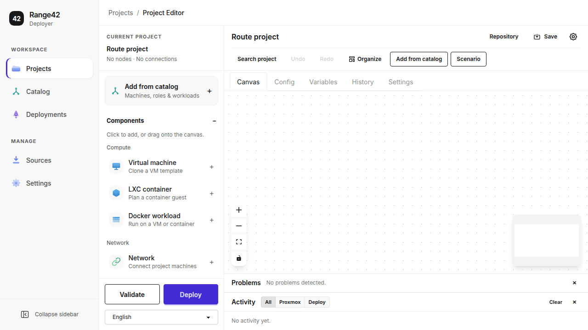
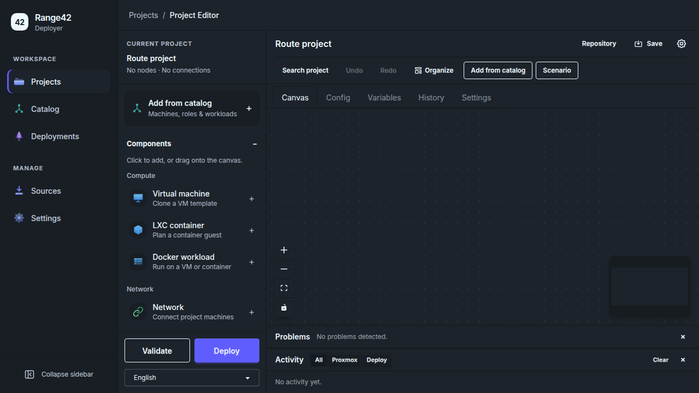
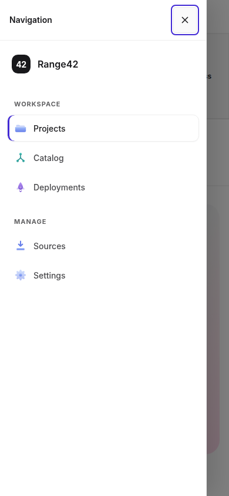

# Navigation and appearance

The September 2026 redesign replaces the initial-only rail and shortcut badges
with labelled navigation and explicit project actions.

## Interaction contract

- **Primary navigation:** Workspace contains Projects, Catalog and Deployments;
  Manage contains Sources and Settings. Detail routes highlight their owning
  section. Links retain normal browser behavior and expose `aria-current`.
- **Desktop space:** navigation starts expanded at 216 px and can collapse to
  72 px. The choice persists across routes and reloads. Opening a project does
  not change that preference. Project tools occupy a separate 272 px sidebar.
- **Small screens:** primary navigation becomes a drawer below 768 px; project
  tools become a drawer below 1024 px. Both use native modal dialogs, labelled
  close buttons, focus containment, Escape, backdrop dismissal and focus return.
- **Project tools:** Components, Resources and Node status are disclosures with
  programmatic expanded state. Components are buttons that can also be dragged.
  Clicking one opens Canvas and selects the new node's configuration, including
  when starting on Config. Node placement is one Undo step. Validate and Deploy
  remain visible at the bottom; Add from catalog opens the existing append flow.
- **Explicit actions:** Search project opens project search; Undo and Redo act on
  the canvas; Save project and Save file use their existing save paths. Removed
  app bindings include the global single-letter navigation and Ctrl/Cmd-P,
  Ctrl/Cmd-Z and Ctrl/Cmd-S interceptors. Tab, Enter, Escape, canvas selection
  keys and CodeMirror's built-in text-editing keys remain available.
- **Appearance:** System is the default; Light and Dark apply immediately and
  persist with the collapsed preference in `range42_ui_preferences`. Storage
  failures leave preferences usable for the current session. Shared colors and
  focus rings use DaisyUI 5 tokens, including canvas controls and minimap.
- **Language:** navigation, project palette, added action labels and Save file
  have English, French and Japanese strings. The project-tools language selector
  uses the existing locale persistence. This does not translate every older page.

The shell provides a skip link and a focusable main region. Navigation and
palette controls have readable labels, visible focus and generous hit areas;
selected states use both an indicator and background/border changes. The existing
reduced-motion setting remains respected. The project creation dialog switches
visibility immediately so its focus trap can activate before its visual fade.

## Implementation boundaries

`AppNavigation.vue` is shared by the expanded/collapsed desktop sidebar and the
mobile drawer. `SidebarDrawer.vue` owns dialog behavior; `Sidebar.vue` owns only
project tools and emits actions. `uiPreferencesStore.ts` holds the two appearance
preferences. Click and drag placement share `useDragAndDrop`.

The route regression fixture now includes the runtime API's `firewall.errors`
and `sdn.errors` arrays. An incomplete response is rejected with the existing
visible error state instead of throwing during render. This is UI response
handling; it does not change firewall, SDN or controller behavior.

The design was reviewed against the
[Web Interface Guidelines](https://github.com/vercel-labs/web-interface-guidelines)
and the installed DaisyUI 5 contract; see its
[color tokens](https://daisyui.com/docs/colors/) and
[migration guide](https://daisyui.com/docs/upgrade/).

## Validation and remaining limits

The complete unit suite passes: **1,779 passed, 10 skipped**. ESLint, application
type checking, the migrated-JavaScript annotation gate, four checker-contract
tests and the production build pass. Vite still reports the existing advisory
for editor/config chunks above 500 kB.

All **28 Chromium browser cases pass**, without retries, against the production
assets. The host-capacity flow opens Project actions with the keyboard and
returns focus there after closing Proxmox settings. The deployment fixture
models release of the editor's Git lock while retaining the deployed revision,
and supplies the current snapshot-list and runtime-response contracts.

Browser acceptance runs against the production build with controlled API and
Git fixtures. It covers navigation, light/dark sidebar accessibility, locale
persistence, mobile focus and layout, adding/undoing/redoing components, editor
tabs, nine application routes, catalog append, repository review, allocation
and deployment handoff. These checks do not contact a live Proxmox host, prove
all-page accessibility or establish successful live deployment.

Production screenshots use an empty local fixture project:







Reproduce with supported Node 24:

```sh
npm run build
npm run preview -- --host 127.0.0.1 --port 4209 --strictPort
```

In another terminal:

```sh
PLAYWRIGHT_TEST_BASE_URL=http://127.0.0.1:4209 npx playwright test \
  e2e/navigation-design.spec.ts e2e/i18n.spec.ts \
  e2e/project-editor-tabs.spec.ts e2e/route-regressions.spec.ts \
  e2e/authoring-controls.spec.ts e2e/catalog-handoff.spec.ts \
  e2e/fork-reuse.spec.ts e2e/deploy-happy.spec.ts e2e/host-capacity.spec.ts \
  --retries=0
```

This redesign has **not been deployed to range42**. Deployment remains through
`range42-context`, subject to the recorded native packaging, firewall and state
integration blockers in the
[deployment report](https://github.com/range42/range42-deployment/blob/6f3ce384b3050349fbad89765bfa90663e803875/docs/21-context-deployment-ssh-results.md).
No Hyde-owned SDN, catalog, playbook or controller code is changed by this work.
